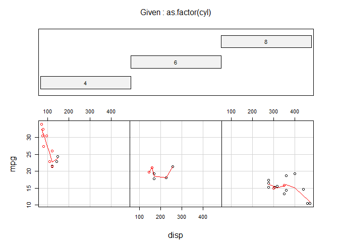
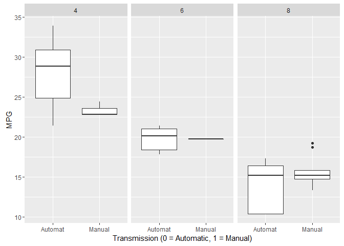
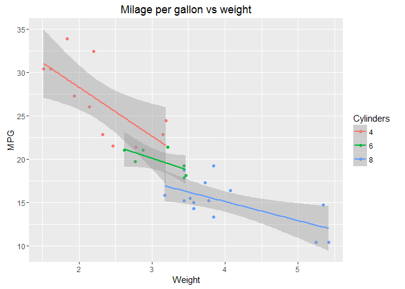
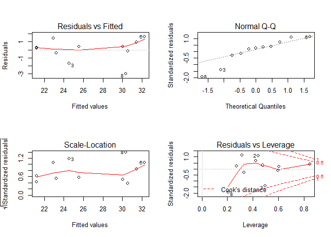
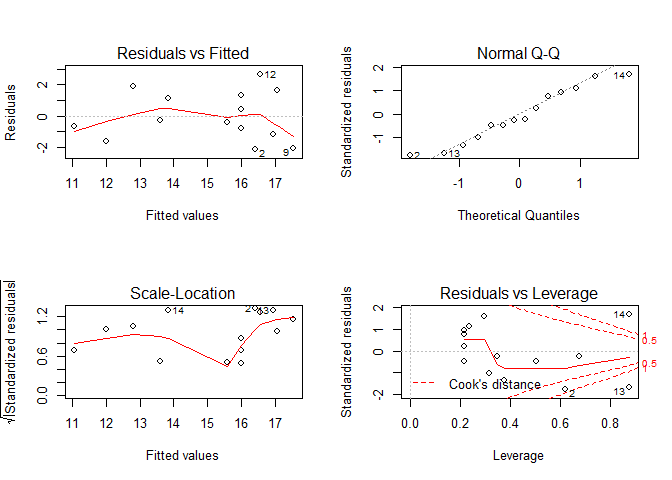

---
#"Will an automatic transmission give you couple of extra miles between gas stations ?"
###author: "Andrii Krasnyi"
###date: "24 January 2016"

This  work is assignment for Coursera: Regression Models course in Data Science Specialization track.

#Executive summary
Assignment task  is to apply regression analysis to evaluate the effect of transmission on the mileage per gallon (mpg) of the cars featured in a standard R data-set, extracted from a 1974 issue of Motor Trends magazine by professors Harold Henderson and Paul Velleman for an article on regression published in 1981.
The questions for assignment are:

* Is an automatic transmission better for MPG?
* Quantify the MPG difference between automatic and manual transmissions

Exploratory data analysis showed that data set need to be clustered by Number of cylinders. following conclusions has been reached: 

* Test of null hypothesis for each cluster showed  that we can rejecte null hypotesis only for 4 cylinders cars, in other clusters null hypothesis cannot be rejected. Which means  can not give an answer to the question of interest - Is an automatic transmission better for MPG?
* Each cluster has different regression model that best fits best. In each model we have more significant regressors than transmission type
* Cluster of cars  with 4 cylinders has the biggest difference between median of cars with manual transmission 6.05 mpg, however transmission type  as regressor has significance less than 5%, therefore this difference mostly explained by other significant regressor such as weight
* For other cluster difference in mpg is insignificant for cars with automated or manual transmission 


#Exploratory data analyses

```r
data(mtcars)
#dim(mtcars)
#summary(mtcars)
head (mtcars)
```

```
##                    mpg cyl disp  hp drat    wt  qsec vs am gear carb
## Mazda RX4         21.0   6  160 110 3.90 2.620 16.46  0  1    4    4
## Mazda RX4 Wag     21.0   6  160 110 3.90 2.875 17.02  0  1    4    4
## Datsun 710        22.8   4  108  93 3.85 2.320 18.61  1  1    4    1
## Hornet 4 Drive    21.4   6  258 110 3.08 3.215 19.44  1  0    3    1
## Hornet Sportabout 18.7   8  360 175 3.15 3.440 17.02  0  0    3    2
## Valiant           18.1   6  225 105 2.76 3.460 20.22  1  0    3    1
```

We used mtcars, a standard data-set in R. It observe 32 cars, model 1973-1974, in terms of fuel efficiency (mpg) and other 10 variables. The selection skews towards exotic cars. "It includes seven Mercedes, a Porsche, a Ferrari and a Maserati", wrote Henderson and Velleman, who collected the data in a paper, as a caveat that one can't derive universal conclusions from that. This might have an effect, for example, on the horsepower (alas, they included a Maserati and a Ferrari) and on the weight of the cars.

Figure 1 in Appendix shows clear segmentation of data in terms of mpg and displacement (cu.in.) when observations are grouped by number of cylinders variable.This plot also shows that number of observation with manual or automated transmission between group of cars with different number of cylinders. As such, we can observe that group cars with 4 cylinders have mostly manual transmission, where 6 and 8 cylinders cars have mostly automated transmission. This give us an idea  that if we will base our analysis on overall data set this might lead us to inaccurate conclusion in regards of first question we need to answer:"Is an automatic transmission better for MPG?". To have more accurate results we need to compare like to like and I suggest to do clustering of observations based on number of cylinders.

For further analysis we will create subset of data grouped on number of cylinders
```
cars_4_cyl<- filter(mtcars, cyl==4)
cars_6_cyl<- filter(mtcars, cyl==6)
cars_8_cyl<- filter(mtcars, cyl==8)

```


Figure 2 in Appendix shows boxplot with averages for manual and automated transmission in each segment.
From this figure we can see significant differences in mpg for cars in segment 4 cylinders, at the same time this difference much less or even does not exist for segments of 6 and 8 cylinders. Median mpg for 4 cyl cars with manual transmission 28.85 for cars with automate transmission 22.8. 
For 6 cyl 
manual 21, automate 18.65. 
For 8 cyl 
manual 15.4, automate 15.2. 

Taking this into account more accurate predictor than transmission type should exist. If we would like to look at whole data-set, such predictor could be weight. Figure 3 in Appendix shows strong correlation of mpg vs weight of cars.   

# Regression model. 
## Nested models analysis
Nested models for  data clustered based on number of cylinders:
As exploratory data analysis showed that more accurate answer for the question of interest can be obtained if we cluster data by number of cylinders, we will start with building models for each cluster first. We think that significant predictors could be wt;disp;carb;hp;qsec and we also need to consider transmission type. 
I will use nested models analysis to select model that fit best. 

### 4 cylinders


```r
ft1_4 <- lm(mpg~am, data = cars_4_cyl)
ft3_4 <- update(ft1_4,mpg~am+wt)
ft4_4 <- update(ft1_4,mpg~am+wt+disp)
ft5_4 <- update(ft1_4,mpg~am+wt+disp+carb)
ft6_4 <- update(ft1_4,mpg~am+wt+disp+carb+hp)
ft7_4 <- update(ft1_4,mpg~am+wt+disp+carb+hp+qsec)
anova(ft1_4,ft3_4,ft4_4,ft5_4,ft6_4,ft7_4)
```

```
## Analysis of Variance Table
## 
## Model 1: mpg ~ am
## Model 2: mpg ~ am + wt
## Model 3: mpg ~ am + wt + disp
## Model 4: mpg ~ am + wt + disp + carb
## Model 5: mpg ~ am + wt + disp + carb + hp
## Model 6: mpg ~ am + wt + disp + carb + hp + qsec
##   Res.Df     RSS Df Sum of Sq      F Pr(>F)
## 1      9 144.955                           
## 2      8  99.853  1    45.102 3.5930 0.1309
## 3      7  69.076  1    30.777 2.4518 0.1924
## 4      6  54.368  1    14.707 1.1716 0.3400
## 5      5  50.371  1     3.997 0.3184 0.6027
## 6      4  50.211  1     0.160 0.0128 0.9154
```
From nested models analysis this cluster two parameters: F statistics and sum of square errors shows that inclusion of all regression coefficients are necessary.  

```r
summary(ft7_4)
```

```
## 
## Call:
## lm(formula = mpg ~ am + wt + disp + carb + hp + qsec, data = cars_4_cyl)
## 
## Residuals:
##       1       2       3       4       5       6       7       8       9 
## -1.2937  1.6629  0.1589  2.8889 -3.2601  2.6959 -1.8218 -2.4693  1.1298 
##      10      11 
##  2.2477 -1.9392 
## 
## Coefficients:
##             Estimate Std. Error t value Pr(>|t|)
## (Intercept) 40.74825   39.66120   1.027    0.362
## am          -0.92380    7.35235  -0.126    0.906
## wt          -1.56374    8.53627  -0.183    0.864
## disp        -0.12996    0.23928  -0.543    0.616
## carb         2.39408    3.18421   0.752    0.494
## hp          -0.04611    0.08224  -0.561    0.605
## qsec         0.20565    1.81908   0.113    0.915
## 
## Residual standard error: 3.543 on 4 degrees of freedom
## Multiple R-squared:  0.7531,	Adjusted R-squared:  0.3828 
## F-statistic: 2.034 on 6 and 4 DF,  p-value: 0.2565
```
This model explains only 38.3 % of variability for 4 cyl cars 


### 6 cylinders
As we  have limited number of observations in this category we will reduce number of regression coefficients for building model. we will use am; wt; disp; carb for building model

```r
ft1_6 <- lm(mpg~am, data = cars_6_cyl)
ft3_6 <- update(ft1_6,mpg~am+wt)
ft4_6 <- update(ft1_6,mpg~am+wt+disp)
ft5_6 <- update(ft1_6,mpg~am+wt+disp+carb)
#ft6_6 <- update(ft1_6,mpg~am+wt+disp+carb+hp)
#ft7_6 <- update(ft1_6,mpg~am+wt+disp+carb+hp+qsec)
anova(ft1_6,ft3_6,ft4_6,ft5_6)
```

```
## Analysis of Variance Table
## 
## Model 1: mpg ~ am
## Model 2: mpg ~ am + wt
## Model 3: mpg ~ am + wt + disp
## Model 4: mpg ~ am + wt + disp + carb
##   Res.Df    RSS Df Sum of Sq      F Pr(>F)
## 1      5 9.1142                           
## 2      4 4.9630  1    4.1512 2.2040 0.2759
## 3      3 3.7837  1    1.1793 0.6261 0.5117
## 4      2 3.7670  1    0.0167 0.0089 0.9335
```
From nested models analysis this cluster two parameters: F statistics and sum of square errors shows that inclusion of all regression coefficients are necessary. Final model for this cluster is

```r
summary(ft4_6)
```

```
## 
## Call:
## lm(formula = mpg ~ am + wt + disp, data = cars_6_cyl)
## 
## Residuals:
##       1       2       3       4       5       6       7 
## -0.3023  0.9298  0.5446 -1.0216  0.9385 -0.4615 -0.6275 
## 
## Coefficients:
##             Estimate Std. Error t value Pr(>|t|)
## (Intercept) 32.08782   19.11941   1.678    0.192
## am          -0.79429    3.80674  -0.209    0.848
## wt          -4.83142    4.99319  -0.968    0.405
## disp         0.01667    0.01724   0.967    0.405
## 
## Residual standard error: 1.123 on 3 degrees of freedom
## Multiple R-squared:  0.7015,	Adjusted R-squared:  0.4031 
## F-statistic:  2.35 on 3 and 3 DF,  p-value: 0.2505
```
This model explains only 40.3% of variability  for 6  cyl cars 

### 8 cylinders

```r
ft1_8 <- lm(mpg~am, data = cars_8_cyl)
ft3_8 <- update(ft1_8,mpg~am+wt)
ft4_8 <- update(ft1_8,mpg~am+wt+disp)
ft5_8 <- update(ft1_8,mpg~am+wt+disp+carb)
ft6_8 <- update(ft1_8,mpg~am+wt+disp+carb+hp)
ft7_8 <- update(ft1_8,mpg~am+wt+disp+carb+hp+qsec)
anova(ft1_8,ft3_8,ft4_8,ft5_8,ft6_8,ft7_8)
```

```
## Analysis of Variance Table
## 
## Model 1: mpg ~ am
## Model 2: mpg ~ am + wt
## Model 3: mpg ~ am + wt + disp
## Model 4: mpg ~ am + wt + disp + carb
## Model 5: mpg ~ am + wt + disp + carb + hp
## Model 6: mpg ~ am + wt + disp + carb + hp + qsec
##   Res.Df    RSS Df Sum of Sq      F  Pr(>F)  
## 1     12 84.990                              
## 2     11 46.062  1    38.928 7.9062 0.02608 *
## 3     10 46.045  1     0.017 0.0034 0.95521  
## 4      9 39.955  1     6.091 1.2370 0.30279  
## 5      8 38.986  1     0.969 0.1968 0.67070  
## 6      7 34.466  1     4.520 0.9179 0.36994  
## ---
## Signif. codes:  0 '***' 0.001 '**' 0.01 '*' 0.05 '.' 0.1 ' ' 1
```
From nested models analysis this cluster two parameters: F statistics and sum of square errors shows that inclusion of all regression coefficients are not necessary. Best fit  model will be is:


```r
summary(ft4_8)
```

```
## 
## Call:
## lm(formula = mpg ~ am + wt + disp, data = cars_8_cyl)
## 
## Residuals:
##     Min      1Q  Median      3Q     Max 
## -2.3836 -1.4702 -0.3707  1.2714  3.5691 
## 
## Coefficients:
##               Estimate Std. Error t value Pr(>|t|)    
## (Intercept) 25.0921682  3.6065666   6.957 3.91e-05 ***
## am          -1.4197947  1.7719597  -0.801   0.4416    
## wt          -2.3757237  1.2741572  -1.865   0.0918 .  
## disp        -0.0008165  0.0135650  -0.060   0.9532    
## ---
## Signif. codes:  0 '***' 0.001 '**' 0.01 '*' 0.05 '.' 0.1 ' ' 1
## 
## Residual standard error: 2.146 on 10 degrees of freedom
## Multiple R-squared:  0.4596,	Adjusted R-squared:  0.2974 
## F-statistic: 2.834 on 3 and 10 DF,  p-value: 0.09232
```
This model explains only 27.7% of variability for 6  cyl cars


#Inference

At this step, we would like to test the null hypothesis at each cluster to check is MPG depends on type of transmission. Null hypothesis will with change of transmission nothing is going on with mpg. Alternative hypothesis is that mpg depends on type of transmission 
We use the two sample T-test to show it. Significance level 5%

### 4 cylinders cars

```r
t.test(mpg~am,data=cars_4_cyl)
```

```
## 
## 	Welch Two Sample t-test
## 
## data:  mpg by am
## t = -2.8855, df = 8.9993, p-value = 0.01802
## alternative hypothesis: true difference in means is not equal to 0
## 95 percent confidence interval:
##  -9.232108 -1.117892
## sample estimates:
## mean in group 0 mean in group 1 
##          22.900          28.075
```
Since the p-value in this cluster is 0.0180171 we can reject our null hypothesis.

### 6 cylinders cars

```r
t.test(mpg~am,data=cars_6_cyl)
```

```
## 
## 	Welch Two Sample t-test
## 
## data:  mpg by am
## t = -1.5606, df = 4.4055, p-value = 0.1871
## alternative hypothesis: true difference in means is not equal to 0
## 95 percent confidence interval:
##  -3.916068  1.032735
## sample estimates:
## mean in group 0 mean in group 1 
##        19.12500        20.56667
```
Since the p-value in this cluster is 0.187123 we cannot reject our null hypothesis.

### 8 cylinders cars

```r
t.test(mpg~am,data=cars_8_cyl)
```

```
## 
## 	Welch Two Sample t-test
## 
## data:  mpg by am
## t = -0.39096, df = 10.195, p-value = 0.7039
## alternative hypothesis: true difference in means is not equal to 0
## 95 percent confidence interval:
##  -2.339549  1.639549
## sample estimates:
## mean in group 0 mean in group 1 
##           15.05           15.40
```
Since the p-value in this cluster is 0.7038727 we cannot reject our null hypothesis.


# Automated model selection
At this step use automated model selection with AIC method for quality measurement to select some statistically significant variables. 

### 4 cylinders segment

```r
init_fit_4  <- lm(mpg ~ ., data = cars_4_cyl)
best_fit_4 <- step(init_fit_4, direction = "both", k=2, trace= 0)
```

```r
summary(best_fit_4)
```

```
## 
## Call:
## lm(formula = mpg ~ disp + wt + am + gear, data = cars_4_cyl)
## 
## Residuals:
##     Min      1Q  Median      3Q     Max 
## -3.0122 -0.2922  0.2704  0.6850  1.6376 
## 
## Coefficients:
##             Estimate Std. Error t value Pr(>|t|)   
## (Intercept) 26.93380    6.32344   4.259  0.00532 **
## disp        -0.29745    0.05835  -5.097  0.00223 **
## wt           3.99619    2.34731   1.702  0.13957   
## am          -7.74789    2.39367  -3.237  0.01776 * 
## gear         6.72312    1.65588   4.060  0.00665 **
## ---
## Signif. codes:  0 '***' 0.001 '**' 0.01 '*' 0.05 '.' 0.1 ' ' 1
## 
## Residual standard error: 1.753 on 6 degrees of freedom
## Multiple R-squared:  0.9094,	Adjusted R-squared:  0.849 
## F-statistic: 15.05 on 4 and 6 DF,  p-value: 0.002775
```

It has the Residual standard error: 1.753 on 6 degrees of freedom. And the Adjusted R-squared:  0.849, which means that the model can explain about 84.9% of the variance of the MPG variable. Weight is the coefficient significant at 0.05 significant level. 

### 6 cylinders segment - we have insuficient number of observations to build automated model

### 8 cylinders segment

```r
init_fit_8  <- lm(mpg ~ ., data = cars_8_cyl)
best_fit_8 <- step(init_fit_8, direction = "both", k=2,trace= 0)
```

```r
summary(best_fit_8)
```

```
## 
## Call:
## lm(formula = mpg ~ disp + hp + drat + am + carb, data = cars_8_cyl)
## 
## Residuals:
##     Min      1Q  Median      3Q     Max 
## -2.1066 -1.0640 -0.3382  1.2654  2.6471 
## 
## Coefficients:
##              Estimate Std. Error t value Pr(>|t|)   
## (Intercept) 32.480207   8.532464   3.807  0.00519 **
## disp        -0.022985   0.009396  -2.446  0.04017 * 
## hp           0.110566   0.060508   1.827  0.10507   
## drat        -5.856584   3.733896  -1.568  0.15540   
## am           4.153893   2.892375   1.436  0.18889   
## carb        -4.021988   1.673169  -2.404  0.04292 * 
## ---
## Signif. codes:  0 '***' 0.001 '**' 0.01 '*' 0.05 '.' 0.1 ' ' 1
## 
## Residual standard error: 1.949 on 8 degrees of freedom
## Multiple R-squared:  0.6432,	Adjusted R-squared:  0.4203 
## F-statistic: 2.885 on 5 and 8 DF,  p-value: 0.08852
```

It has the Residual standard error: 1.949 on 8 degrees of freedom. And the Adjusted R-squared:  0.4203, which means that the model can explain about 42% of the variance of the MPG variable. Horsepower, Rear axle ratio, Transmission are coefficients significant at 0.05 significant level. 


For overall data set


```r
init_fit <- lm(mpg ~ ., data = mtcars)
best_fit <- step(init_fit, direction = "both", k=2, trace= 0)
#summary(init_fit)
```


```r
summary(best_fit)
```

```
## 
## Call:
## lm(formula = mpg ~ wt + qsec + am, data = mtcars)
## 
## Residuals:
##     Min      1Q  Median      3Q     Max 
## -3.4811 -1.5555 -0.7257  1.4110  4.6610 
## 
## Coefficients:
##             Estimate Std. Error t value Pr(>|t|)    
## (Intercept)   9.6178     6.9596   1.382 0.177915    
## wt           -3.9165     0.7112  -5.507 6.95e-06 ***
## qsec          1.2259     0.2887   4.247 0.000216 ***
## am            2.9358     1.4109   2.081 0.046716 *  
## ---
## Signif. codes:  0 '***' 0.001 '**' 0.01 '*' 0.05 '.' 0.1 ' ' 1
## 
## Residual standard error: 2.459 on 28 degrees of freedom
## Multiple R-squared:  0.8497,	Adjusted R-squared:  0.8336 
## F-statistic: 52.75 on 3 and 28 DF,  p-value: 1.21e-11
```

. It has the Residual standard error: 2.459 on 28 degrees of freedom. And the Adjusted R-squared:  0.8336, which means that the model can explain about 83 % of the variance of the MPG variable. However no coefficients are significant at 0.05 significant level. 


#Model Residuals and Diagnostics

In this section, we have the residual plots of our regression model along with computation of regression diagnostics for our liner model. This exercise helped us in examining the residuals and finding leverage points to find any potential problems with the model.
We will do diagnostics by segments analysed. Please refer to Figure 4 - 4 cylinders cars and Figure 5 - 8 cylinders cars in Appendix

*4 cylinders cars*


*8 cylinders cars*


Following observations are made from the both set of plots above 

1. The points in the Residuals vs. Fitted plot are randomly scattered on the plot that verifies the independence condition.
2. The Normal Q-Q plot consists of the points which mostly fall on the line indicating that the residuals are normally distributed.
3. The Scale-Location plot consists of points scattered in a constant band pattern, indicating constant variance.
4. There are some distinct points of interest (outliers or leverage points) in the top right of the plots that may indicate values of increased leverage of outliers.


# Conclusions
Based on the analyses performed we can conclude that when date are split into 3 clusters base on number of cylinders.

1. Test of null hypothesis for each cluster showed  that we can rejecte null hypotesis only for 4 cylinders cars, in other clusters null hypothesis cannot be rejected. Which means  can not give an answer to the question of interest - Is an automatic transmission better for MPG? 
2. Each cluster has different regression model that best fits observation we have. In each model we have more significant regressors than transmission type
3. Cluster of cars has the biggest difference between median of cars with manual transmission 6.05, however am as regressor has significance less than 5%, there for this difference mostly explained by significant regressor such as weight.


# Appendix 
## Figure 1 

```r
require(graphics)
#pairs(mtcars, main = "mtcars data")
coplot(mpg ~ disp | as.factor(cyl), col= factor(mtcars$am), data = mtcars, panel = panel.smooth, rows = 1)
```

\


## Figure 2

Boxplot for mpg vs type of transmission  with facets for cyl


```r
library(ggplot2)
p <- ggplot(data= mtcars, aes(factor(mtcars$am), mpg))
p <- p + geom_boxplot() +
         scale_x_discrete(breaks=c(0, 1),
                      labels=c("Automat", "Manual")) +
         ylab("MPG")+
         xlab("Transmission (0 = Automatic, 1 = Manual)")
p <- p + facet_grid (.~cyl)
print(p)
```

\


## Figure 3 


```r
p <- qplot(wt,mpg, data = mtcars, colour = factor(mtcars$cyl)) 
p <- p + geom_smooth(method=lm)
p <- p + labs(title = "Milage per gallon vs weight", x = "Weight", y="MPG", colour="Cylinders")
    print(p)
```

\


## Figure 4 

*4 cylinders cars*


```r
par(mfrow=c(2, 2))
plot(best_fit_4)
```

\


## Figure 5 

*8 cylinders cars*


```r
par(mfrow=c(2, 2))
plot(best_fit_8)
```

\

